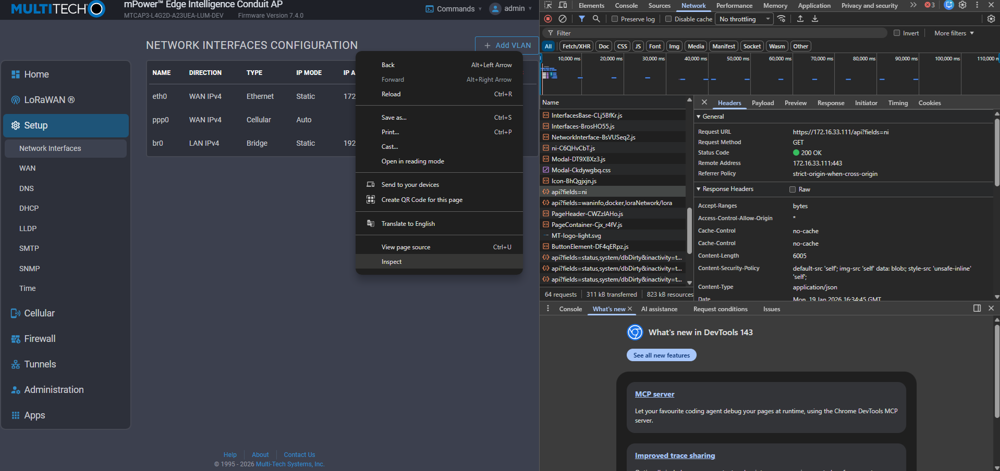

# mPower Edge Intelligence Device API

Complete REST API documentation for managing Multi-Tech Systems IoT gateway devices (mPower Edge Intelligence platform).

## Overview

The mPower Device API is a comprehensive RESTful API that provides complete control and monitoring capabilities for MTS IoT gateway devices including Conduit, MultiConnect, and other mPower-enabled devices.

### Key Features

- **System Configuration**: Device information, capabilities, and system settings
- **Cellular Connectivity**: Provider profiles, SIM management, connection monitoring
- **Network Services**: WiFi, DNS, DHCP, routing, VPN tunnels
- **Security**: Firewall, certificates, user authentication and authorization
- **IoT Protocols**: LoRa network server, SCADA protocols (BACnet, Modbus)
- **Device Management**: Firmware updates, diagnostics, Docker containers
- **Location Services**: GPS configuration and tracking
- **Communication**: SMS messaging, serial port configuration

## Documentation Resources

### 📘 [Complete API Guide](mpower-api-docs/API-README.md)
Comprehensive documentation with detailed explanations, authentication guide, complete endpoint reference, code examples, configuration workflows, and troubleshooting.

### 📋 [Quick Reference](mpower-api-docs/API-QUICK-REFERENCE.md)
Concise command reference with all endpoints at a glance, common usage patterns, and quick copy-paste examples.

### 📑 [Documentation Index](mpower-api-docs/API-DOCUMENTATION-INDEX.md)
Master index with overview of all documentation, how-to guides, tool integration, and quick start instructions.

### 🔧 OpenAPI/Swagger Specification
- **[YAML Format](mpower-api-docs/api-documentation.yaml)** - For Swagger UI and code generators
- **[JSON Format](mpower-api-docs/api-documentation.json)** - For programmatic access

### 📦 [Postman Collection](mpower-api-docs/MTS-Device-API.postman_collection.json)
Ready-to-import Postman collection with pre-configured requests for all major endpoints.

### 📐 Detailed Schema Documentation

Comprehensive field-by-field documentation for complex configuration objects:

- **[LoRa Network Schema](mpower-api-docs/LORA-NETWORK-SCHEMA.md)** - Complete `loraNetwork` configuration with 200+ properties covering Network Server, Packet Forwarder, Basic Station, and ChirpStack modes
- **[Security Schemas](mpower-api-docs/SECURITY-SCHEMAS.md)** - Authentication, certificates, and security configuration
- **[NAT & Firewall Schemas](mpower-api-docs/NAT-FIREWALL-SCHEMAS.md)** - NAT rules, port forwarding, and firewall configuration
- **[VPN Schemas](mpower-api-docs/VPN-SCHEMAS.md)** - OpenVPN, IPsec, and GRE tunnel configuration
- **[Network Interfaces Schema](mpower-api-docs/NETWORK-INTERFACES-SCHEMA.md)** - Ethernet, cellular, WiFi, and network interface configuration
- **[Alert Schema](mpower-api-docs/ALERT-SCHEMA.md)** - Alert and notification configuration
- **[SNMP Schema](mpower-api-docs/SNMP-SCHEMA.md)** - SNMP agent and trap configuration
- **[Schema Coverage Analysis](mpower-api-docs/SCHEMA-COVERAGE-ANALYSIS.md)** - Overview of all documented schemas and coverage status

### 🔍 New Discovery Documentation (December 2025)

#### [Undocumented Endpoints Findings](mpower-api-docs/UNDOCUMENTED-ENDPOINTS-FINDINGS.md)
**19+ newly discovered configuration endpoints** including:
- **Network Management**: WAN failover, load balancing, DDNS, IP passthrough, LLDP, mDNS
- **Security**: Remote access controls, RADIUS, bootloader security, reset button config
- **Cellular**: Carrier-specific backoff timers, cellular time sync
- **System**: Auto-reboot scheduler, cloud management, branding, custom apps
- **Notifications**: SMTP, event groups, NTP time sync

#### [Stats Monitoring System](mpower-api-docs/STATS-ENDPOINTS-DISCOVERY.md)
**33+ stats categories** for comprehensive device monitoring:
- System stats (CPU, memory, storage, services)
- Network stats (interfaces, DNS, connectivity)
- Cellular stats (radio, signal, SIM status, PDP config)
- IoT stats (LoRa, Modbus, GPS, Bluetooth)
- VPN stats (OpenVPN, IPsec, GRE)
- **Dashboard endpoint** - Single-call comprehensive system overview

#### [Discovery Session Summary](mpower-api-docs/SESSION-SUMMARY-2025-12-17.md)
Complete report of the December 2025 discovery session with testing methodology, results, and insights from live gateway testing.

#### [Quick Discovery Reference](mpower-api-docs/DISCOVERY-SUMMARY.txt)
Visual ASCII summary of all discoveries with quick reference tables.

### 📚 Implementation Guides

Production-ready guides for common use cases:

- **[Monitoring Best Practices](mpower-api-docs/MONITORING-BEST-PRACTICES.md)** - Complete monitoring strategies with polling intervals, alert thresholds, Python/Bash scripts, and Prometheus exporter examples
- **[WAN Failover Configuration](mpower-api-docs/WAN-FAILOVER-GUIDE.md)** - Complete guide to WAN failover and load balancing with FAILOVER vs LOADBALANCE modes, health check strategies, and configuration examples
- **[API Client Examples](mpower-api-docs/CLIENT-EXAMPLES.md)** - Production-ready client implementations in Python, Node.js, and Bash with authentication, error handling, and common use cases
- **[LoRa Operations Workflow](mpower-api-docs/LORA-OPERATIONS-WORKFLOW.md)** - Complete FOTA and multicast messaging workflows with step-by-step API call sequences, file upload procedures, and code examples

### 🧪 Testing & Validation Reports

Comprehensive testing documentation:

- **[PUT Operations Test Report](mpower-api-docs/PUT-OPERATIONS-TEST-REPORT.md)** - Results from testing 17 PUT endpoints (76% success rate) with detailed error analysis, workarounds, and recommendations
- **[User Role Permissions Report](mpower-api-docs/USER-ROLE-PERMISSIONS-REPORT.md)** - Admin role permissions documented (100% access), permission matrix, RBAC patterns, and security guidelines

## Quick Start

### Discovering API Calls Using Browser Developer Tools

A useful technique for learning the API is to use your browser's developer tools to observe the API calls made by the mPower web interface. This helps you discover the exact endpoints, request formats, and payload structures used by the device.



**Steps to capture API calls:**

1. Open your browser's Developer Tools (F12, or right-click → Inspect)
2. Navigate to the **Network** tab
3. Filter by "Fetch/XHR" to see only API requests
4. Perform an action in the mPower web UI (e.g., change a setting)
5. Click on the captured request to view:
   - **Request URL** - The exact endpoint being called
   - **Request Method** - GET, PUT, POST, or DELETE
   - **Request Payload** - The JSON data being sent
   - **Response** - The data returned by the device

This is especially helpful for complex configurations where the endpoint structure may include array indices (e.g., `/api/ni/nis/6` for updating a specific network interface).

### Authentication

The API uses session-based authentication with cookies:

```bash
# Login
curl -X POST http://192.168.2.1/api/login \
  -H "Content-Type: application/json" \
  -d '{"username": "admin", "password": "admin"}' \
  -c cookies.txt

# Use session cookie for subsequent requests
curl -X GET "http://192.168.2.1/api?fields=system" -b cookies.txt

# Logout
curl -X POST http://192.168.2.1/api/logout -b cookies.txt
```

### Basic API Usage

#### Query Resources

```bash
# Get system information
curl -X GET "http://192.168.2.1/api?fields=system" -b cookies.txt

# Get multiple resources
curl -X GET "http://192.168.2.1/api?fields=system,cellular,users" -b cookies.txt

# Get nested fields
curl -X GET "http://192.168.2.1/api?fields=system/capabilities" -b cookies.txt
```

#### Update Configuration

```bash
# Update system settings
curl -X PUT http://192.168.2.1/api/system \
  -H "Content-Type: application/json" \
  -d '{"deviceName": "MyDevice"}' \
  -b cookies.txt

# Save configuration
curl -X POST http://192.168.2.1/api/command/save -b cookies.txt
```

#### Execute Commands

```bash
# Restart device
curl -X POST http://192.168.2.1/api/command/restart -b cookies.txt

# Ping test
curl -X POST http://192.168.2.1/api/command/ping \
  -H "Content-Type: application/json" \
  -d '{"host": "8.8.8.8", "count": 4}' \
  -b cookies.txt
```

## API Structure

### Resource Endpoints

| HTTP Method | Pattern | Description |
|-------------|---------|-------------|
| GET | `/api?fields=<resource>` | Retrieve resource data |
| PUT | `/api/<resource>` | Update entire resource |
| POST | `/api/<resource>` | Create new resource item |
| DELETE | `/api/<resource>/<id>` | Delete resource item |

### Available Resources

#### Core System
- `system` - Device information and capabilities
- `status` - System status notifications
- `users` - User account management
- `customRoles` - Custom role definitions
- `autoReboot` - 🆕 Automatic reboot scheduler
- `brand` - 🆕 White-label branding configuration
- `customAppsConfig` - 🆕 Custom application settings
- `resetButton` - 🆕 Physical reset button configuration
- `bootloader` - 🆕 Bootloader security settings

#### Network
- `cellular` - Cellular connectivity
- `wifi` - WiFi access point and client
- `dns` - DNS server configuration
- `dhcp` - DHCP server configuration
- `routes` - Static routes
- `firewall` - Firewall rules
- `nat` - NAT configuration
- `wanmngr` - 🆕 WAN failover and load balancing
- `waninfo` - 🆕 Real-time WAN interface status
- `ipPassthrough` - 🆕 IP passthrough/bridge mode
- `ipPipes` - 🆕 IP pipe tunnels
- `lldp` - 🆕 Link Layer Discovery Protocol
- `mdns` - 🆕 Multicast DNS (Bonjour)
- `ddns` - 🆕 Dynamic DNS configuration

#### Cellular
- `backOffTimers` - 🆕 Carrier-specific retry timers
- `cellTimeSync` - 🆕 Cellular time synchronization

#### VPN
- `ovpnTunnels` - OpenVPN tunnels
- `ipsecTunnels` - IPsec tunnels
- `greTunnels` - GRE tunnels

#### IoT Protocols
- `loraNetwork` - LoRa network server
- `lora` - LoRa gateway management
- `scada` - SCADA protocol configuration
- `mqttBroker` - MQTT broker

#### Device Management
- `docker` - Docker container management
- `gps` - GPS configuration and data
- `serial` - Serial port configuration
- `sms` - SMS messaging
- `remoteMgmt` - 🆕 Multi-Tech cloud management

#### Security
- `certificate` - Device certificates
- `cacertificates` - CA certificates
- `secureProtocols` - TLS/SSL protocols
- `remoteAccess` - 🆕 HTTP/HTTPS/SSH/SNMP security
- `radius` - 🆕 RADIUS authentication

#### Notifications
- `smtp` - 🆕 SMTP email configuration
- `sntp` - 🆕 NTP time synchronization
- `notificationEventGroup` - 🆕 Event notification groups

#### Monitoring (Stats)
- `stats/dashboard` - 🆕 Comprehensive system overview
- `stats/radio` - 🆕 Cellular radio statistics
- `stats/memory` - 🆕 Memory usage
- `stats/cpu` - 🆕 CPU usage
- `stats/iface` - 🆕 Network interface statistics
- `stats/lora` - 🆕 LoRa gateway statistics
- ...and 28+ more stats categories

### Command Endpoints

Commands are executed via POST to `/api/command/<command>`:

#### Configuration Commands
- `save` - Save configuration to persistent storage
- `revert` - Revert to last saved configuration
- `restart` - Restart device

#### Firmware Commands
- `firmware_upgrade` - Upgrade device firmware
- `radio/firmware_upgrade` - Upgrade cellular radio firmware

#### Network Commands
- `ping` - Execute ping test
- `reset_modem` - Reset cellular modem
- `reset_wifi` - Reset WiFi module

## Interactive Documentation

### View in Swagger UI

1. Go to [Swagger Editor](https://editor.swagger.io/)
2. Click File → Import File
3. Select the [api-documentation.yaml](mpower-api-docs/api-documentation.yaml) file
4. Explore and test the API interactively

### Import to Postman

1. Open Postman
2. Click Import → Upload Files
3. Select [MTS-Device-API.postman_collection.json](mpower-api-docs/MTS-Device-API.postman_collection.json)
4. Update the `baseUrl` variable to your device IP
5. Start making requests!

## Generate Client Code

Use OpenAPI Generator to create client libraries in various languages:

```bash
# Install OpenAPI Generator
npm install @openapitools/openapi-generator-cli -g

# Generate Python client
openapi-generator-cli generate \
  -i mpower-api-docs/api-documentation.yaml \
  -g python \
  -o ./python-client

# Generate JavaScript/TypeScript client
openapi-generator-cli generate \
  -i mpower-api-docs/api-documentation.yaml \
  -g typescript-axios \
  -o ./typescript-client

# Generate Java client
openapi-generator-cli generate \
  -i mpower-api-docs/api-documentation.yaml \
  -g java \
  -o ./java-client
```

## Role-Based Access Control

The API implements role-based access control with three built-in roles:

| Role | Description | Access Level |
|------|-------------|--------------|
| **Admin** | Full system access | Read/Write/Execute all |
| **User** (Engineer) | Configuration access | Read/Write most, limited security |
| **Guest** (Monitor) | Read-only access | Read status/monitoring only |

## Response Format

All API responses follow a consistent JSON format:

### Success Response
```json
{
  "success": true,
  "result": {
    // Response data varies by endpoint
  }
}
```

### Error Response
```json
{
  "success": false,
  "error": "Error message description",
  "code": 404
}
```

## Configuration Workflow

The device uses a two-stage configuration model:

1. **Runtime Configuration** - Changes made via PUT requests update the runtime configuration
2. **Persistent Configuration** - Use `POST /api/command/save` to persist changes

### Typical Workflow

```bash
# 1. Login
curl -X POST http://192.168.2.1/api/login \
  -d '{"username":"admin","password":"admin"}' -c cookies.txt

# 2. Get current configuration
curl -X GET "http://192.168.2.1/api?fields=cellular" -b cookies.txt

# 3. Update configuration
curl -X PUT http://192.168.2.1/api/cellular \
  -d '{"enabled": true}' -b cookies.txt

# 4. Save configuration
curl -X POST http://192.168.2.1/api/command/save -b cookies.txt

# 5. Logout
curl -X POST http://192.168.2.1/api/logout -b cookies.txt
```

## Examples

### Cellular Configuration

```bash
# Get cellular configuration
curl -X GET "http://192.168.2.1/api?fields=cellular" -b cookies.txt

# Enable cellular with provider profile
curl -X PUT http://192.168.2.1/api/cellular \
  -H "Content-Type: application/json" \
  -b cookies.txt \
  -d '{
    "enabled": true,
    "providerProfiles": [{
      "_id": "550e8400-e29b-41d4-a716-446655440000",
      "profileName": "My Carrier",
      "cellularMode": "4g-preferred",
      "dataCtx": {
        "apnString": "internet",
        "contextIpMode": "AUTO",
        "authentication": {
          "type": "NONE",
          "username": "",
          "password": ""
        }
      }
    }]
  }'

# Save configuration
curl -X POST http://192.168.2.1/api/command/save -b cookies.txt
```

### User Management

```bash
# List all users
curl -X GET "http://192.168.2.1/api?fields=users" -b cookies.txt

# Create new user
curl -X POST http://192.168.2.1/api/users \
  -H "Content-Type: application/json" \
  -b cookies.txt \
  -d '{
    "name": "engineer1",
    "password": "password123",
    "permission": "user",
    "firstName": "John",
    "lastName": "Doe",
    "email": "john.doe@example.com"
  }'

# Save changes
curl -X POST http://192.168.2.1/api/command/save -b cookies.txt
```

### Network Interface Configuration (BR0 Bridge)

Network interfaces are stored in an array and must be updated by index. Use `GET /api?fields=ni` to retrieve all interfaces and identify the index of the interface you want to modify.

```bash
# Get all network interfaces
curl -X GET "http://192.168.2.1/api?fields=ni" -b cookies.txt

# Update BR0 bridge interface (index 6 in this example)
# Use browser developer tools to find the correct index for your device
curl -X PUT http://192.168.2.1/api/ni/nis/6 \
  -H "Content-Type: application/json" \
  -b cookies.txt \
  -d '{
    "MAC": "",
    "available": true,
    "bridge": "br0",
    "ipv4": {
      "dns1": "8.8.8.8",
      "dns2": "",
      "gateway": "",
      "ip": "192.168.100.1",
      "mask": "255.255.255.0",
      "mode": "STATIC",
      "wanMasquerade": true
    },
    "ipv6": {
      "delegatedPrefixLength": 64,
      "dns1": "",
      "dns2": "",
      "enabled": false,
      "fixedIp": [],
      "gateway": "",
      "ip": [],
      "linkLocalIp": [],
      "mode": "DELEGATED",
      "prefixDelegationEnabled": false
    },
    "name": "br0",
    "nitype": "BRIDGE",
    "type": "LAN",
    "vlanId": -1
  }'

# Save configuration
curl -X POST http://192.168.2.1/api/command/save -b cookies.txt
```

**Note:** The interface index varies by device model and configuration. Common interfaces and typical indices:
- `eth0` - Index 0 (WAN Ethernet)
- `eth1`, `eth2` - Indices 1, 2 (LAN Ethernet ports)
- `ppp0` - Cellular PPP interface
- `wlan0` - WiFi as WAN
- `wlan1` - WiFi Access Point
- `br0` - Bridge interface (often index 6)

### LoRa Network Server

```bash
# Get LoRa configuration
curl -X GET "http://192.168.2.1/api?fields=loraNetwork" -b cookies.txt

# Update single field - network server name
curl -X PUT http://192.168.2.1/api/loraNetwork \
  -H "Content-Type: application/json" \
  -b cookies.txt \
  -d '{
    "network": {
      "name": "My Gateway"
    }
  }'

# Update top-level field - backup interval
curl -X PUT http://192.168.2.1/api/loraNetwork \
  -H "Content-Type: application/json" \
  -b cookies.txt \
  -d '{"backupInterval": 7200}'

# Update nested field - MQTT enabled
curl -X PUT http://192.168.2.1/api/loraNetwork \
  -H "Content-Type: application/json" \
  -b cookies.txt \
  -d '{
    "mqtt": {
      "enabled": true
    }
  }'

# Update packet forwarder channel plan
curl -X PUT http://192.168.2.1/api/loraNetwork \
  -H "Content-Type: application/json" \
  -b cookies.txt \
  -d '{
    "packetForwarder": {
      "channelPlan": "US915"
    }
  }'

# Restart LoRa service to apply changes
curl -X POST http://192.168.2.1/api/lora/restart -b cookies.txt
```

### System Monitoring

```bash
# Get comprehensive dashboard view (most useful!)
curl -X GET "http://192.168.2.1/api?fields=stats/dashboard" -b cookies.txt

# Get cellular radio statistics
curl -X GET "http://192.168.2.1/api?fields=stats/radio" -b cookies.txt

# Get memory usage
curl -X GET "http://192.168.2.1/api?fields=stats/memory" -b cookies.txt

# Get interface statistics
curl -X GET "http://192.168.2.1/api?fields=stats/iface_ppp0" -b cookies.txt

# Monitor without session timeout (for continuous monitoring)
curl -X GET "http://192.168.2.1/api?fields=stats/radio&inactivity=true" -b cookies.txt

# Get LoRa gateway statistics
curl -X GET "http://192.168.2.1/api/lora/gateways" -b cookies.txt

# Get LoRa devices
curl -X GET "http://192.168.2.1/api/lora/devices" -b cookies.txt
```

### WAN Failover Configuration

```bash
# Get WAN manager configuration
curl -X GET "http://192.168.2.1/api?fields=wanmngr" -b cookies.txt

# Configure WAN failover
curl -X PUT http://192.168.2.1/api/wanmngr \
  -H "Content-Type: application/json" \
  -b cookies.txt \
  -d '{
    "mode": "FAILOVER",
    "wans": [
      {
        "interface": "eth0",
        "priority": 1,
        "monitor": {
          "mode": "ACTIVE",
          "checkInterval": 60,
          "active": {
            "type": "ICMP",
            "hostname": "8.8.8.8",
            "icmpCount": 5
          }
        }
      },
      {
        "interface": "ppp0",
        "priority": 2,
        "monitor": {
          "mode": "ACTIVE",
          "checkInterval": 60,
          "active": {
            "type": "ICMP",
            "hostname": "8.8.8.8",
            "icmpCount": 10
          }
        }
      }
    ]
  }'

# Get real-time WAN status
curl -X GET "http://192.168.2.1/api?fields=waninfo" -b cookies.txt

# Save configuration
curl -X POST http://192.168.2.1/api/command/save -b cookies.txt
```

## Troubleshooting

### Common Issues

**401 Unauthorized**
- Solution: Login first with `/api/login`
- Check: Session cookie is being sent

**409 Conflict**
- Solution: Device may be in commissioning mode
- Check: `/api/policy` endpoint

**Changes not persisting**
- Solution: Call `/api/command/save` after changes
- Check: `system/dbDirty` status

**Device unavailable**
- Solution: Wait for device to complete startup
- Check: `/api/policy` for device state

## Support

For technical support and additional documentation:
- Visit: [Multi-Tech Support Portal](https://support.multitech.com)
- Email: support@multitech.com
- GitHub: [MultiTechSystems](https://github.com/MultiTechSystems)

## Version Information

- **API Version**: Based on mPower Edge Intelligence platform
- **Documentation Version**: 1.0.0
- **Last Updated**: December 17, 2025
- **OpenAPI Version**: 3.0.3

---

**Related Documentation:**
- [LoRaWAN App Connect](lorawan-app-connect)
- [Conduit Custom App Development](conduit-custom-app-development)
- [Conduit Cursor Development](conduit-cursor-development)
